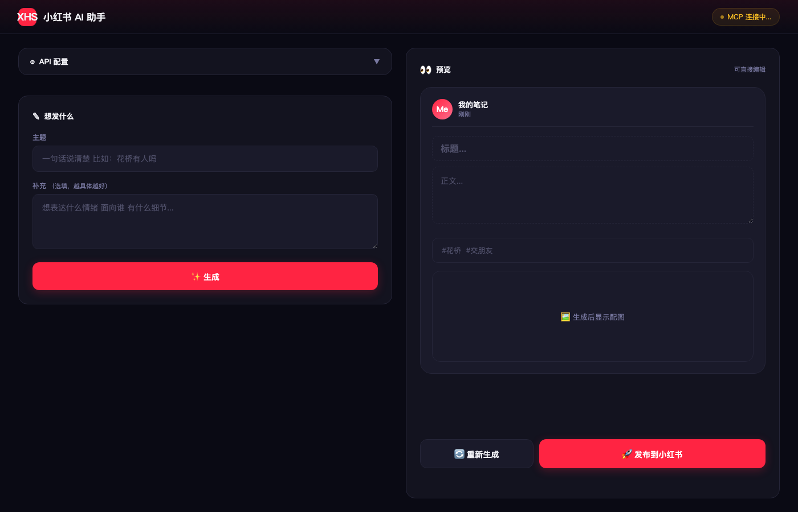

# 小红书 MCP Server

基于 MCP 协议的小红书自动化工具，支持 AI 生成内容、一键发布、定时发布、多端使用。

## 项目预览

### Web UI 界面



> 左侧输入主题，AI 自动生成拟人化文案 + 封面图，右侧实时预览，一键发布到小红书

### AI 生成封面示例


> 极简风格封面，一句话钩子，高点击率

## 功能特性

- 小红书扫码登录，Cookie 自动管理
- AI 生成拟人化文案 + 封面图（支持自定义 LLM）
- 一键发布图文笔记 / 视频笔记
- 每日定时自动发布（模板轮换）
- 搜索笔记、点赞、收藏、评论、回复
- 查看用户主页和笔记详情
- Web UI 可视化操作界面
- 移动端 / Web 插件（Capacitor）
- 支持 Claude Desktop、Cursor 等 MCP 客户端接入

## 使用方式

| 方式 | 说明 |
|------|------|
| **Web UI** | 浏览器可视化操作，AI 生成内容 + 预览 + 发布 |
| **MCP Server** | 接入 Claude Desktop / Cursor 等 AI 客户端 |
| **每日自动发布** | Cron 定时任务，模板轮换，Cookie 过期自动通知 |
| **移动端插件** | Capacitor 打包，手机端直接使用 |

### Web UI

```bash
# 一键启动 MCP 服务 + Web UI
./start.sh all

# 或者分别启动
./start.sh mcp    # 启动 MCP 服务 (端口 18060)
./start.sh web    # 启动 Web UI  (端口 7788)
```

访问 `http://localhost:7788`，配置 API Key 后即可使用。

### MCP Server

MCP 服务启动后监听 `http://localhost:18060/mcp`，支持 JSON-RPC 2.0 协议。

**Claude Desktop 配置** (`~/.claude.json`):

```json
{
  "mcpServers": {
    "xiaohongshu": {
      "type": "http",
      "url": "http://localhost:18060/mcp"
    }
  }
}
```

**Cursor 配置** (`.cursor/mcp.json`):

```json
{
  "mcpServers": {
    "xiaohongshu": {
      "url": "http://localhost:18060/mcp"
    }
  }
}
```

### 每日自动发布

```bash
# 手动执行一次
./start.sh daily

# 设置 Cron 定时任务（每天 12:00 发布）
crontab -e
0 12 * * * cd /path/to/xiaohongshu-mcp && ./start.sh daily >> /tmp/xhs_daily.log 2>&1
```

- 3 套内容模板按天轮换
- Cookie 过期时自动发送 Mac 桌面通知 + 弹出二维码

### 移动端 / Web 插件

`android-app/` 目录为 Capacitor 项目，支持打包为 Android/iOS App 或直接作为 Web 页面使用。前端直接调用 AI API，无需后端。

## 快速开始

### 1. 下载

```bash
git clone https://github.com/2975647277/xiaohongshu-mcp.git
cd xiaohongshu-mcp
```

### 2. 安装依赖

```bash
# 需要 Python 3.10+
./start.sh install
```

### 3. 下载 MCP 二进制文件

从 [Release](https://github.com/2975647277/xiaohongshu-mcp/releases) 页面下载对应平台的二进制文件，放到项目根目录：

- macOS ARM: `xiaohongshu-mcp-darwin-arm64`
- Windows: `xiaohongshu-mcp-windows-amd64.exe`

### 4. 启动

```bash
./start.sh all
```

首次使用需要扫码登录，登录后 Cookie 自动保存。

## 配置

首次启动 Web UI 后，在页面顶部展开"API 配置"面板，填写：

| 配置项 | 说明 | 示例 |
|--------|------|------|
| API Key | LLM API 密钥 | `sk-xxx` |
| Base URL | API 地址 | `https://api.openai.com/v1` |
| Model | 模型名称 | `gpt-4o` / `claude-sonnet-4-6` |
| 坐标 | 内容中的地理位置关键词 | `花桥` |

配置保存在本地 `config.json`，不会上传。

## MCP 工具列表

| 工具 | 说明 |
|------|------|
| `check_login_status` | 检查登录状态 |
| `get_login_qrcode` | 获取登录二维码 |
| `delete_cookies` | 清除登录 Cookie |
| `publish_content` | 发布图文笔记 |
| `publish_with_video` | 发布视频笔记 |
| `search_feeds` | 搜索笔记 |
| `list_feeds` | 获取笔记列表 |
| `get_feed_detail` | 获取笔记详情 |
| `like_feed` | 点赞笔记 |
| `favorite_feed` | 收藏笔记 |
| `post_comment_to_feed` | 评论笔记 |
| `reply_comment_in_feed` | 回复评论 |
| `user_profile` | 查看用户主页 |

## 系统要求

- Python 3.10+
- macOS / Windows
- Playwright + Chromium（用于 HTML 转封面图）
- 小红书 App（扫码登录用）

## 项目结构

```
xiaohongshu-mcp/
├── start.sh                          # 统一启动脚本
├── app.py                            # Flask Web UI
├── daily_post.py                     # 每日自动发布
├── xiaohongshu-mcp-darwin-arm64      # MCP 服务 (macOS)
├── xiaohongshu-login-darwin-arm64    # 登录服务 (macOS)
├── templates/index.html              # Web UI 页面
├── static/                           # 静态资源
├── android-app/                      # 移动端 Capacitor 项目
│   └── www/index.html                # 移动端页面
└── deploy/                           # 构建部署脚本
```

## 免责声明

- 本项目仅供学习和研究使用
- 使用本工具产生的一切后果由使用者自行承担
- 请遵守小红书平台的使用规则和服务条款
- 不得用于任何违法违规用途

## 联系方式

| 赏金打赏 | 沟通交流群 | 个人微信 |
|:---:|:---:|:---:|
|  |  |  |
| 觉得好用可以打赏支持 | 扫码加入交流群，问题反馈/功能建议 | 加我微信，备注「小红书MCP」 |

## License

MIT
